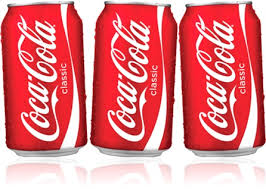

# Projeto FoodBox


Este projeto é uma página web simples que permite ao usuário escolher um combo de prato, bebida e sobremesa. O usuário pode clicar em botões para escolher o prato (frango ou carne), a bebida (Coca-Cola ou suco de laranja) e a sobremesa (pudim ou sorvete de morango). Uma vez que o usuário fez suas escolhas, ele pode clicar no botão "finalizar pedido" para enviar seu pedido por meio do WhatsApp. A mensagem enviada incluirá todas as escolhas do usuário.

## Para desenvolver o projeto FoodBox, são necessários os seguintes requisitos:

- Conhecimento básico de HTML, CSS e JavaScript.
- Entender a estrutura de uma página web.
- Conhecer as propriedades de estilo CSS para customizar a aparência da página.
- Conhecer as funções básicas do JavaScript para manipular elementos da página e realizar ações a partir de interações do usuário.
- Conhecer a API do WhatsApp para enviar mensagens.
- Compreender o fluxo de informações e ações da página para realizar o pedido.
- Testar o projeto em diferentes dispositivos e navegadores para garantir compatibilidade.
- Implementar a validação de dados para garantir que todas as informações necessárias para realizar o pedido estejam disponíveis.
- Documentar o código de forma clara e organizada para facilitar manutenção e atualizações futuras.
- Realizar testes para garantir a qualidade e correção do projeto.

## Index.html

```html
<!DOCTYPE html>
<html lang="en">
  <head>
    <meta charset="UTF-8" />
    <meta name="viewport" content="width=device-width, initial-scale=1.0" />
    <meta http-equiv="X-UA-Compatible" content="ie=edge" />
    <title>FoodBox</title>
    <link rel="stylesheet" href="style.css" />
    <link rel="preconnect" href="https://fonts.googleapis.com" />
    <link rel="preconnect" href="https://fonts.gstatic.com" crossorigin />
    <link
      href="https://fonts.googleapis.com/css2?family=Righteous&family=Roboto:wght@400;700&display=swap"
      rel="stylesheet"
    />

  </head>

  <body>
    <div class="Topo">
      <h1>FoodBox</h1>
      <h2>Monte seu Box e receba em 15 minutos!</h2>
    </div>

    <h3>Primeiro, seu prato</h3>
    <div id="Frango" class="Produto" onclick="escolherFrango()">
      
      <h4>Frango Yin-Yang</h4>
      <p>Frango frito com salada e um pouco de batata</p>
      <p class="preco">R$ 19,90</p>
    </div>
    <div id="Carne" class="Produto" onclick="escolherCarne()">
      
      <h4>Carne e salada</h4>
      <p>Carne partida ao meio acompanhando alface e tomate</p>
      <p class="preco">R$ 24,90</p>
    </div>

    <h3>Agora, sua bebida</h3>
    <div id="Coca" class="Produto" onclick="escolherCoca()">
      
      <h4>Coca-cola gelada</h4>
      <p>Original</p>
      <p class="preco">R$ 5,90</p>
    </div>
    <div id="Suco" class="Produto" onclick="escolherSuco()">
      
      <h4>Suco-Laraja</h4>
      <p>100% Natural</p>
      <p class="preco">R$ 5,90</p>
    </div>

    <h3>Por fim, sua sobremesa</h3>
    <div id="Pudim" class="Produto" onclick="escolherPudim()">
      
      <h4>Pudim</h4>
      <p>Muito delicioso e saboroso</p>
      <p class="preco">R$ 7,90</p>
    </div>
    <div id="Sorvete" class="Produto" onclick="escolherSorvete()">
      
      <h4>Soverte - Morango</h4>
      <p>Três bolas como na foto</p>
      <p class="preco">R$ 6,90</p>
    </div>

    <div class="botao" onclick="finalizarPedido()">
      Finalizar pedido
    </div>
    <script src="script.js"></script>
  </body>
</html>


```

Este é um código HTML para uma página web "FoodBox". A página apresenta opções de pratos, bebidas e sobremesas para o usuário escolher e finalizar o pedido. As opções são apresentadas com imagens, títulos, descrições e preços. A interação do usuário com a página é feita através de funções JavaScript, que são acionadas ao clicar em cada opção. A página também usa estilos CSS e fonte do Google Fonts para a aparência.


## Style.css

```css
body {
    background: lightgray;
    font-family: "Roboto";
  }

.Topo {
background: rgb(184, 27, 27);
color: white;
padding: 15px;
border-radius: 10px;
box-shadow: 0 0 10px 0 rgb(230, 9, 9);
}
.Produto {
background: white;
padding: 15px;
border-radius: 10px;
margin-bottom: 10px;
box-shadow: 0 0 10px whitesmoke;
cursor: pointer;
border: 5px solid white;
}

h1 {
margin: 0;
font-family: "Righteous";
font-weight: normal;
}

h2 {
margin: 0;
font-size: 18px;
font-weight: normal;
}

h3 {
font-size: 30px;
margin-bottom: 5px;
font-family: "Righteous";
font-weight: normal;
}

h4 {
margin-top: 0;
margin-bottom: 5px;
font-size: 20px;
}

img {
width: 130px;
border-radius: 5px;
float: right;
margin-left: 15px;
}

p {
margin: 15px 0 0 0;
}

.preco {
font-weight: bold;
font-size: 18px;
}

.botao {
background: green;
text-align: center;
padding: 15px;
margin-top: 30px;
margin-bottom: 100px;
border-radius: 50px;
color: white;
font-weight: bold;
font-size: 18px;
cursor: pointer;
box-shadow: 0 0 10px 0 greenyellow;
}
```

Este é um exemplo de estilo CSS para uma página web. Ele define a aparência de elementos HTML como `body`, `.Topo`, `.Produto`, `h1`, `h2`, `h3`, `h4`, `img`, `p`, `.preco` e `.botao`.

Algumas propriedades incluem: cor de fundo, fonte, bordas arredondadas, sombra, cursor, etc. Por exemplo, a classe `.Topo` tem um fundo vermelho escuro com sombra, enquanto a classe `.Produto` tem um fundo branco e bordas arredondadas. A classe `.botao` tem uma cor de fundo verde e fonte em branco em negrito.

## Index.js

```javascript
let prato;
let bebida;
let sobremesa;

function escolherFrango() {
  document.getElementById("Frango").style.borderColor = "green";
  document.getElementById("Carne").style.borderColor = "white";
  prato = "Frango Yin-Yang";
}
function escolherCarne() {
  document.getElementById("Carne").style.borderColor = "green";
  document.getElementById("Frango").style.borderColor = "white";
  prato = "Carne e Salada";
}

function escolherCoca() {
  document.getElementById("Coca").style.borderColor = "green";
  document.getElementById("Suco").style.borderColor = "white";
  bebida = "Coca-Cola";
}
function escolherSuco() {
  document.getElementById("Suco").style.borderColor = "green";
  document.getElementById("Coca").style.borderColor = "white";
  bebida = "Suco de Laranja";
}

function escolherPudim() {
  document.getElementById("Pudim").style.borderColor = "green";
  document.getElementById("Sorvete").style.borderColor = "white";
  sobremesa = "Pudim";
}
function escolherSorvete() {
  document.getElementById("Sorvete").style.borderColor = "green";
  document.getElementById("Pudim").style.borderColor = "white";
  sobremesa = "Sorvete de Morango";
}
function finalizarPedido() {
  let mensagem;

  mensagem =
    "Olá gostaria de pedir um combo: " +
    prato +
    ", " +
    bebida +
    " e " +
    sobremesa;

  window.open("https://wa.me/+5519988313921?text=" + mensagem);
}

```

Este é um exemplo de código JavaScript para uma aplicação de delivery de comida. O código define as funções para escolher o prato, bebida e sobremesa. A função finalizarPedido cria uma mensagem de texto combinando as escolhas do usuário e abre o aplicativo WhatsApp para enviar a mensagem para o número de telefone especificado.

# **Acesse o Link e confira: https://food-box-seven.vercel.app/**


# ⭐️**Deixe um Star** ⭐️

Obrigado por conferir meu repository! É muito gratificante saber que alguém está interessado no meu trabalho. Se você gostou do que viu, deixar um star seria uma grande ajuda no meu crescimento e me motivaria a continuar fazendo projetos. O apoio de pessoas como você é fundamental para que eu possa seguir evoluindo e produzindo conteúdos cada vez melhores. Obrigado mais uma vez e espero que você possa acompanhar meus futuros projetos!

